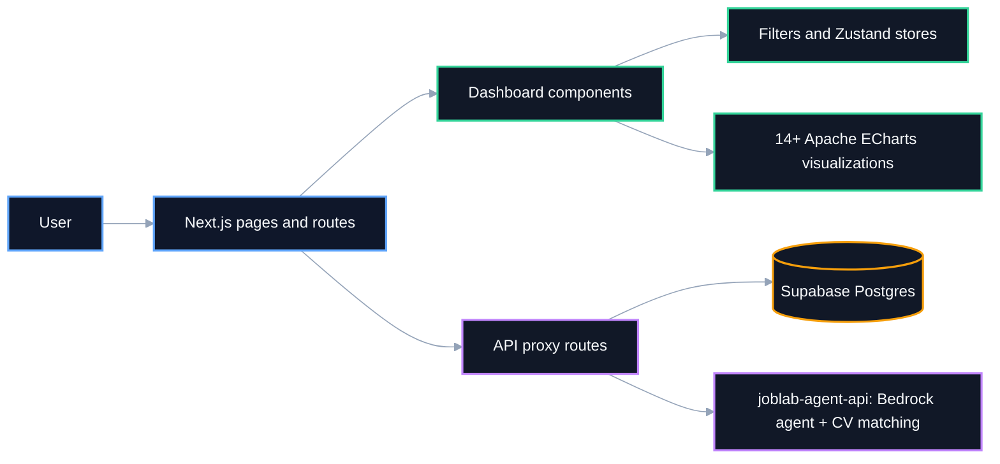
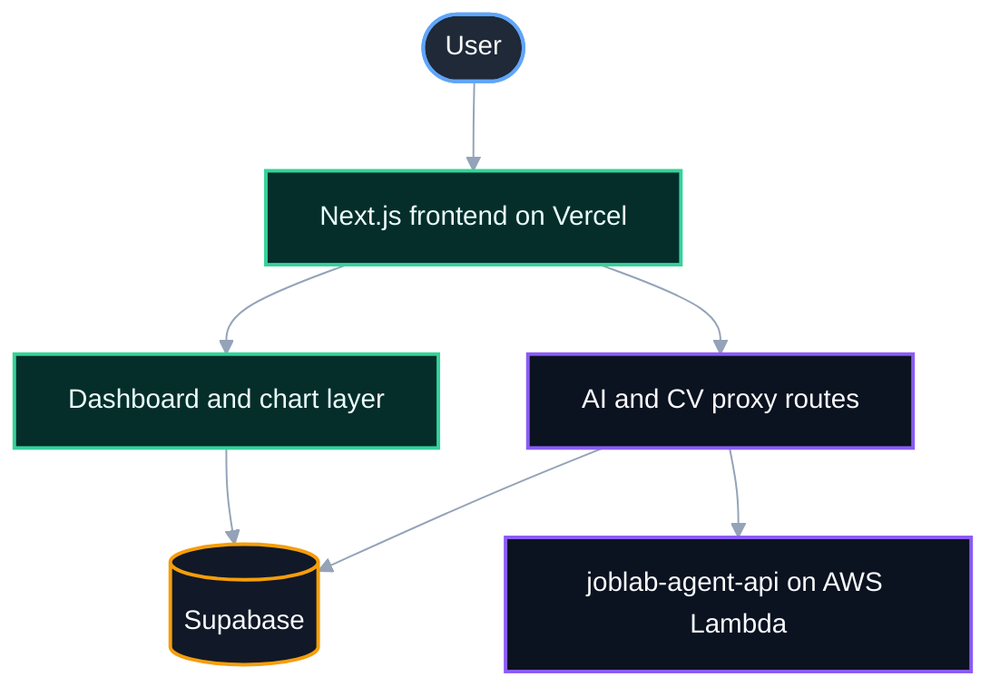

# JobLab Analytics Frontend

Next.js frontend for job analytics, **AI chat**, search workflows, and **CV matching**, with a 14-chart Apache ECharts dashboard over a **Supabase** Postgres data layer.


> ⭐ If this project is useful for your work or research, consider starring it.

## Overview

This is the user-facing dashboard for the **JobLab** product family — a set of tools for exploring the operations-research and data-science job market. It sits on top of a **Supabase**-backed Postgres database populated by a companion [scraping/enrichment **data pipeline**](https://github.com/Mbehbahani/joblab-data-pipeline) and talks to a companion [**AI agent** backend](https://github.com/Mbehbahani/joblab-agent-api) for chat and CV matching.

**This repository is best described as:**

- A **Next.js App Router** dashboard with 14+ interactive Apache ECharts visualizations (country/remote distribution, industry treemaps, skills word clouds, time series, heatmaps, sunburst views)
- An **AI-assisted exploration surface** — chat panel and CV matcher UI proxying to a Bedrock-backed agent API
- A **Supabase-driven** analytics layer with filter-driven KPI cards, job lookup, and search

## Tech stack

| Component | Responsibility | Tech |
|---|---|---|
| Framework | App Router, SSR/client rendering | Next.js 16 |
| Language | Type safety | TypeScript 5 |
| UI | Components, layout | Mantine 8 |
| Data viz | 14+ chart types | Apache ECharts |
| Data layer | Postgres-backed job data | Supabase |
| State | Dashboard/filter state | Zustand |
| Data fetching | Client-side caching | SWR |
| AI backend | Chat + CV matching | [joblab-agent-api](https://github.com/Mbehbahani/joblab-agent-api) (FastAPI + **AWS Bedrock**) |

## Architecture



The frontend never talks to Bedrock or Postgres credentials directly for AI features — it proxies through `src/app/api/ai/*` to the backend, keeping the service-role key and model access server-side only.

## Dashboard capabilities

Implemented across [`src/components/charts/`](src/components/charts/) (14 chart components):

- Country/remote distribution, industry × function analysis, education × function relationships
- Time series, heatmap, sunburst, and treemap views
- Skills word cloud and tools bar chart
- KPI cards, filter bar, and job lookup panel ([`src/components/dashboard/`](src/components/dashboard/), [`src/components/filters/`](src/components/filters/))

## AI, CV, and search features

- **AI chat** — [`src/components/ai/AiPanel.tsx`](src/components/ai/AiPanel.tsx), [`AiInsightPanel.tsx`](src/components/ai/AiInsightPanel.tsx), [`AiJobResults.tsx`](src/components/ai/AiJobResults.tsx) — proxied through [`src/app/api/ai/`](src/app/api/ai/)
- **CV matcher** — [`src/components/ai/CVMatcher.tsx`](src/components/ai/CVMatcher.tsx) — PDF/text upload, matched through [`src/app/api/ai/match-cv/`](src/app/api/ai/match-cv/) to embedding-based similarity scoring on the backend
- **Job search and lookup** — [`src/app/api/jobs/`](src/app/api/jobs/), [`src/app/api/jobs/lookup/`](src/app/api/jobs/lookup/)

## Quickstart

```bash
git clone https://github.com/Mbehbahani/joblab-analytics-frontend.git
cd joblab-analytics-frontend
cp .env.example .env.local   # fill in Supabase + backend URL
npm install
npm run dev
```

Open <http://localhost:3000/dashboard>.

## Configuration

All variables live in [`.env.example`](.env.example).

| Variable | Required | Description |
|---|---|---|
| `NEXT_PUBLIC_SUPABASE_URL` | yes | Public Supabase project URL for client-side data access |
| `NEXT_PUBLIC_SUPABASE_ANON_KEY` | yes | Public anon key for browser usage |
| `SUPABASE_SERVICE_ROLE_KEY` | server routes only | Service role for trusted server-side API routes |
| `SUPABASE_URL` | optional | Server-side fallback URL |
| `LLM_BACKEND_URL` | optional | [joblab-agent-api](https://github.com/Mbehbahani/joblab-agent-api) base URL for AI chat and CV matching proxy routes |
| `NEXT_PUBLIC_SITE_URL` | optional | Canonical site URL for SEO metadata |

## Available scripts

```bash
npm run dev
npm run build
npm run start
npm run lint
```

## Project structure

```text
.
├── src/
│   ├── app/
│   │   ├── api/            # AI chat, CV match, jobs, filters proxy routes
│   │   └── dashboard/
│   ├── components/
│   │   ├── ai/              # chat panel, insights, CV matcher
│   │   ├── charts/           # 14+ Apache ECharts components
│   │   ├── dashboard/        # KPI cards, jobs table, lookup panel
│   │   ├── filters/
│   │   ├── jobs/
│   │   ├── layout/
│   │   └── onboarding/       # first-visit tour
│   ├── lib/
│   ├── providers/
│   ├── store/                 # Zustand state
│   └── types/
├── .env.example
├── AGENTS.md
├── LICENSE
└── README.md
```

## Deployment

Deployed as a standard Next.js app (Vercel) with **Supabase** as the data source and [joblab-agent-api](https://github.com/Mbehbahani/joblab-agent-api) as the AI backend. See [`VERCEL_DEPLOYMENT.md`](VERCEL_DEPLOYMENT.md).



## Roadmap / TO-DO

- [ ] Add automated component/integration tests
- [ ] Add a hero screenshot to this README
- [ ] Wire CI (lint + build) via `.github/workflows/`

## Related links

- [joblab-agent-api](https://github.com/Mbehbahani/joblab-agent-api) — AI agent + CV matching backend
- [joblab-data-pipeline](https://github.com/Mbehbahani/joblab-data-pipeline) — scraping/enrichment pipeline feeding this dashboard

## Security note

This repository's git history was scrubbed of committed database credentials with `git-filter-repo` prior to publication. Any credentials that were ever committed have been rotated or replaced.

## License

[MIT](LICENSE) © 2026 M.Behbahani
